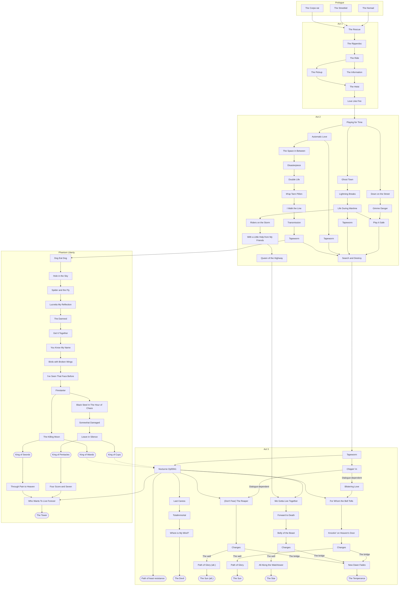

```mermaid
flowchart TD
    subgraph "Prologue"
    nomad[The Nomad]
    street[The Streetkid]
    corpo[The Corpo-rat]
    end
    subgraph "Act 1"
    rescue[The Rescue]
    ripperdoc[The Ripperdoc]
    ride[The Ride]
    pickup[The Pickup]
    information[The Information]
    heist[The Heist]
    lovelikefire[Love Like Fire]
    rescue --> ripperdoc
    ripperdoc --> ride
    ride --> information & pickup
    information & pickup --> heist
    heist --> lovelikefire
    end
    nomad --> rescue
    street --> rescue
    corpo --> rescue
    subgraph "Act 2"
    lovelikefire --> playingfortime[Playing for Time]
    playingfortime --> panam[Ghost Town] & takemura[Down on the Street] & clouds[Automatic Love]
    clouds --> tapeworm2[Tapeworm] & fingers[The Space in Between]
    fingers --> Disasterpiece
    Disasterpiece --> doublelife[Double Life]
    doublelife --> maptannpelen[M'ap Tann Pèlen]
    maptannpelen --> gim[I Walk the Line]
    gim --> Transmission
    Transmission --> tapeworm3[Tapeworm]
    panam --> powerstation[Lightning Breaks]
    powerstation --> hellman[Life During Wartime]
    hellman --> tapeworm1[Tapeworm]
    hellman --> panamsaul[Riders on the Storm] -->
    basiliskjob[With a Little Help from My Friends] --> 
    highwayqueen[Queen of the Highway]
    takemura --> industrialpark[Gimme Danger]
    industrialpark --> parade[Play It Safe]
    hellman --> parade
    parade[Play It Safe] --> hanako[Search and Destroy]
    end
    subgraph "Act 3"
    nocturne[Nocturne Op55N1]
    Tapeworm
    suicide([Path of least resistance])
    Tapeworm --> nocturne
    Tapeworm --> chippinin[Chippin' In] -->|Dialogue-dependent| blisteringlove[Blistering Love] --> rogue_end
    hanako_end[Last Caress] -->
    Totalimmortal -->
    surgery[Where is My Mind?] ----> devil([The Devil])
    chippinin -->|Dialogue-dependent| secret
    secret["(Don't Fear) The Reaper"] ----> changes3[Changes] -->|The well| pathofglory_alt["Path of Glory (alt.)"] --> sun_alt(["The Sun (alt.)"])
    rogue_end[For Whom the Bell Tolls]
    rogue_end ---> rogue_assault[Knockin' on Heaven's Door] --> changes1[Changes] -->|The well| pathofglory[Path of Glory] --> sun(["The Sun"])
    panam_end[We Gotta Live Together] --> panam_outside
    panam_outside[Forward to Death] -->
    panam_inside[Belly of the Beast] -->
    changes2[Changes] -->|The well| watchtower[All Along the Watchtower] -->
    star([The Star])
    changes1 & changes2 & changes3 -->|The bridge| newdawn[New Dawn Fades] -->
    temperance([The Temperance])
    end
    subgraph "Phantom Liberty"
    dogtown[Dog Eat Dog] -->
    president[Hole in the Sky] -->
    spider[Spider and the Fly] -->
    reed[Lucretia My Reflection] -->
    slider[The Damned] -->
    partyprep[Get It Together] -->
    party[You Know My Name] -->
    rentalcar[Birds with Broken Wings] -->
    twins[I've Seen That Face Before] -->
    Firestarter --> route_songbird[The Killing Moon]
    Firestarter --> route_reed[Black Steel In The Hour of Chaos]
    route_reed --> bunker[Somewhat Damaged] -->
    reed_end[Leave in Silence]
    reed_end --> cups([King of Cups])
    reed_end --> pentacles([King of Pentacles])
    route_songbird --> wands([King of Wands])
    route_songbird --> swords([King of Swords])
    pentacles ---> reed_epilogue[Four Score and Seven]
    swords ---> songbird_epilogue[Through Pain to Heaven]
    reed_epilogue & songbird_epilogue -->
    pl_ending[Who Wants To Live Forever] -->
    tower([The Tower])
    end
    nocturne ---> hanako_end & rogue_end & panam_end & secret & pl_ending
    nocturne --------> suicide
    cups & wands -.-> nocturne
    tapeworm3 --> dogtown
    hanako --> Tapeworm
    tapeworm1 & tapeworm2 & tapeworm3 --> hanako
    highwayqueen --> panam_end
```
